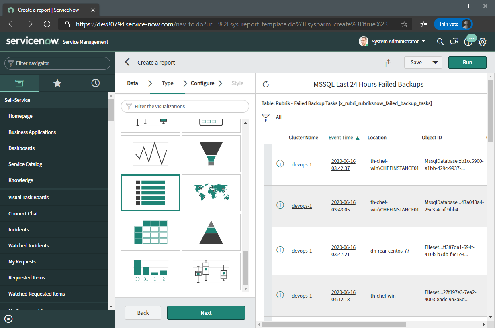

# ServiceNow Dashboard Creation Guide

## Overview

This document offers some guidance for customers to be able to create their own dashboards using the Rubrik ServiceNow tables as the basis, allowing them to provide customised dashboards for application teams.

NOTE: details on the requirements within ServiceNow as far as access permissions for creation and maintenance of reports and dashboards are available at the following links: (Reports)[https://docs.servicenow.com/bundle/orlando-performance-analytics-and-reporting/page/use/reporting/reference/reporting-landing-page.html], (Dashboards)[https://docs.servicenow.com/bundle/orlando-performance-analytics-and-reporting/page/use/dashboards/reference/dashboards-landing-page.html].

## Terminology

This guide focuses on two core concepts within ServiceNow: Reports and Dashboards. These are defined below:

* Reports - enables users to create and distribute reports that show the current state of instance data, such as how many open incidents of each priority there are. Reporting functionality is available by default for all tables, except for system tables.
* Dashboards - enables users to display multiple performance analytics, reporting, and other widgets on a single screen

## Scenario

For the limited scenario in this guide, we will look at creating an MSSQL Dashboard for our database administration team to be able to monitor their failed backups from within ServiceNow. This will empower them to be able to confirm that Rubrik backups are taking place as planned, and quickly identify any issues experienced.

## Creating Reports

The first thing we need to do is to create a report. Our dashboard will consist of one or more of these visualizations, and helps to present the data in a simple way for consumption. We will create a simple table in this case of failed backups, along with the failure source, and the reason for the failure.

In the navigator on the left hand side of the window, search for 'Reports' and click 'Create New'

Enter a name for the report, here we are naming it `MSSQL Last 24 Hours Failed Backups`, select 'Source Type' as `Table`, and select the source table, in this case it is the `Rubrik - Failed Backup Tasks` table. Click 'Next' when done.

Select the visualization type, there are many options here, and the correct one for your report/dashboard will depend on the data type and what is being communicated, here we will seelct the 'List' visualization, which is a table view. Click 'Next' once selected.

Click the 'Choose columns' button, and select the columns you want to include in the report, here we have selected: Cluster Name, Event Time, Location, Object Name, and Reason. Once done click OK. It is also possible to select 'Group by' options here if you wanted to further sort by specific data in the table, such as by Cluster Name or Location.

In the right hand pane we can add filters to the table to specify the exact data we want, here we have added 'Object Type > is > MsSql' to show only MSSQL backup failures. We could also add time and other filters here by clicking 'New Criteria'. The 'Run' button up on top of this pane can be used to see the results of our current report selection criteria. Once the report is as desired, click 'Save' to save the report. You can come back later and edit the report as required.

The report is now available in the ServiceNow interface. This can be viewed standalone, but we really want this in a Dashboard so we can provide a single place for multiple Reports.

## Creating a Dashboard

Now we can create a dashboard to group our reports together in one place.

In the navigator on the left hand side of the window, click the 'Dashboards' link under 'Self-Service'

This will take you to the dashboard browser where we can see existing dashboards.

Click the 'New Report' button, give the report a name, an order and add any role or group restrictions needed to the dashboard.

Under the 'Add Widgets' selector on the right hand side, select 'Reports' from the drop down, here we can see pre-built reports, and search for the report we created earlier.

Enter MSSQL into the search bar as shown, the report we created in the last section should be displayed.

Click Add to add the report to the dashboard. The buttons at the top of the added report can be used to resize or modify how it is shown on the dashboard as required

The dashboard is now available for viewing.

A link to this dashboard can now be provided to users or groups as required. More reports can be created and added as needed.